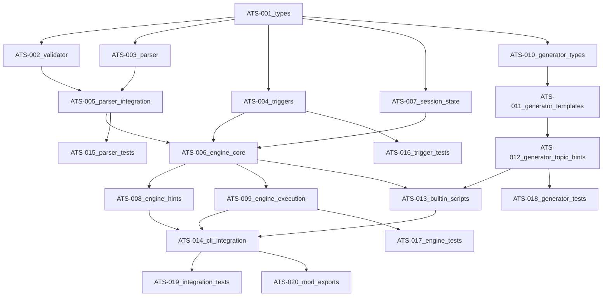

# Phase 4 — AI Teaching System — Task Plan

This document breaks Phase 4's AI Teaching System into **small, parallelizable tasks** for multiple agents, with explicit dependencies and order of execution.

Source: `.specs/deno-rewrite/plan.md` (Phase 4), legacy reference: `_.local-leetcode-trainer.legacy/scripts/dynamic/ai-teaching-engine.js`

## Executive Summary

The AI Teaching System provides intelligent, proactive coaching for users solving algorithmic problems. It uses a YAML-based DSL (trainer.yaml) to define teaching scripts that respond to user code, execution results, and progress patterns.

### Key Capabilities

- **Proactive guidance**: Provides contextual hints without explicit requests
- **Code analysis**: Analyzes user code patterns to provide relevant feedback
- **Execution feedback**: Interprets stdout, stderr, and test results
- **Progressive hints**: Escalates guidance based on attempts and struggle patterns
- **Script generation**: Auto-generates teaching scripts from problem metadata

## Scope

- **In scope**: Teaching script DSL types, parser, validator, trigger evaluator, teaching engine core, script generator, session management, CLI integration hooks
- **Out of scope** (Phase 4): Full test runner (separate task), LeetCode API scraping (separate task), AI/LLM-powered hint generation (future enhancement)

## Conventions (from existing repo)

- **Tests**: `test/` directory, `*.test.ts` naming
- **Imports**: `@std/*` for stdlib; include `.ts` for relative imports
- **Errors**: Use `TeachingError`, `ScriptError` + `createErrorContext()` (`src/utils/errors.ts`)
- **12-factor output**: Human-readable messages to stderr via `src/utils/output.ts`; stdout for machine output only
- **YAML parsing**: Use `@std/yaml` for parsing trainer.yaml files

## Phase 4 Deliverables

- Teaching system types: `src/core/ai/types.ts`
- DSL parser and validator: `src/core/ai/parser.ts`, `src/core/ai/validator.ts`
- Trigger expression evaluator: `src/core/ai/triggers.ts`
- Teaching engine: `src/core/ai/engine.ts`
- Script generator: `src/core/ai/generator.ts`
- Session state management: `src/core/ai/session.ts`
- Built-in teaching scripts: `src/data/scripts/`
- CLI integration: `src/cli/commands/` updates

## Target File/Module Layout

```
src/
├── core/
│   └── ai/
│       ├── mod.ts              # Public API re-exports
│       ├── types.ts            # All AI teaching types
│       ├── parser.ts           # YAML script parser
│       ├── validator.ts        # Script validation
│       ├── triggers.ts         # Trigger expression evaluator
│       ├── engine.ts           # Main teaching engine
│       ├── generator.ts        # Script template generator
│       └── session.ts          # Session state management
├── data/
│   └── scripts/                # Built-in teaching scripts
│       └── <problem-slug>/
│           └── trainer.yaml
└── utils/
    └── errors.ts               # Add TeachingError, ScriptError

test/
├── ai/
│   ├── parser.test.ts
│   ├── validator.test.ts
│   ├── triggers.test.ts
│   ├── engine.test.ts
│   ├── generator.test.ts
│   └── session.test.ts
```

## Dependency Graph



## Parallel Execution Lanes

- **Lane A (Core Types & Parsing)**: ATS-001 → (ATS-002 + ATS-003 + ATS-004 in parallel) → ATS-005 → ATS-015
- **Lane B (Engine)**: ATS-006 → (ATS-008 + ATS-009 in parallel) → ATS-017
- **Lane C (Generator)**: ATS-010 → ATS-011 → ATS-012 → ATS-018
- **Lane D (Session)**: ATS-007 (can start after ATS-001, joins at ATS-006)
- **Lane E (Scripts & Integration)**: ATS-013 → ATS-014 → ATS-019 → ATS-020

## Task Summary

| ID      | Task                                   | Depends on                | Parallelizable? | Est. Hours |
| ------- | -------------------------------------- | ------------------------- | --------------- | ---------- |
| ATS-001 | Define teaching system types           | -                         | Yes             | 2-3        |
| ATS-002 | Implement script validator             | ATS-001                   | Yes             | 2-3        |
| ATS-003 | Implement YAML parser (basic)          | ATS-001                   | Yes             | 1-2        |
| ATS-004 | Implement trigger expression evaluator | ATS-001                   | Yes             | 3-4        |
| ATS-005 | Integrate parser with validator        | ATS-002, ATS-003          | Limited         | 1-2        |
| ATS-006 | Implement teaching engine core         | ATS-004, ATS-005, ATS-007 | Limited         | 3-4        |
| ATS-007 | Implement session state management     | ATS-001                   | Yes             | 2-3        |
| ATS-008 | Implement hint retrieval system        | ATS-006                   | Yes             | 2-3        |
| ATS-009 | Implement execution feedback system    | ATS-006                   | Yes             | 2-3        |
| ATS-010 | Define generator types and templates   | ATS-001                   | Yes             | 1-2        |
| ATS-011 | Implement base script generator        | ATS-010                   | Limited         | 2-3        |
| ATS-012 | Add topic-specific hint generators     | ATS-011                   | Yes             | 2-3        |
| ATS-013 | Create built-in teaching scripts       | ATS-006, ATS-012          | Yes             | 3-4        |
| ATS-014 | CLI command integration                | ATS-008, ATS-009, ATS-013 | Limited         | 3-4        |
| ATS-015 | Parser and validator tests             | ATS-005                   | Yes             | 2-3        |
| ATS-016 | Trigger evaluator tests                | ATS-004                   | Yes             | 2-3        |
| ATS-017 | Engine tests                           | ATS-009                   | Yes             | 2-3        |
| ATS-018 | Generator tests                        | ATS-012                   | Yes             | 1-2        |
| ATS-019 | Integration tests                      | ATS-014                   | Yes             | 2-3        |
| ATS-020 | Public API exports (mod.ts)            | ATS-014                   | Yes             | 0.5-1      |

**Total estimated effort**: 35-45 hours

## Waves

Waves of issues that can be assigned in sequence:

Wave 0: ATS-001

Wave 1: ATS-002, ATS-003, ATS-004, ATS-007, ATS-010

Wave 2: ATS-005, ATS-011, ATS-016

Wave 3: ATS-006, ATS-012, ATS-015

Wave 4: ATS-008, ATS-009, ATS-018

Wave 5: ATS-013, ATS-017

Wave 6: ATS-014

Wave 7: ATS-019, ATS-020

---

## ATS-001 — Define Teaching System Types

- **Depends on**: None
- **Goal**: Establish all TypeScript types for the teaching system DSL and runtime.
- **Parallelizable**: Yes (foundation task, no dependencies)

### Subtasks

1. **Define DSL step types** (`TeachingStepType`):

   ```typescript
   type TeachingStepType =
     | 'intro' // Introduction when problem starts
     | 'pre_prompt' // Pre-coding guidance
     | 'on_run' // Triggered after code execution
     | 'after_success' // Triggered after all tests pass
     | 'on_request' // Triggered by explicit user request
     | 'hint'; // Contextual hints based on code analysis
   ```

2. **Define teaching step interface** (`TeachingStep`):

   ```typescript
   interface TeachingStep {
     type: TeachingStepType;
     content: string; // Markdown content with variable substitution
     trigger?: string; // JavaScript-like expression (optional)
     keywords?: string[]; // For on_request type only
   }
   ```

3. **Define teaching script interface** (`TeachingScript`):

   ```typescript
   interface TeachingScript {
     id: string;
     title: string;
     difficulty: Difficulty;
     tags: string[];
     language: SupportedLanguage;
     steps: TeachingStep[];
   }
   ```

4. **Define user session state** (`TeachingSessionState`):

   ```typescript
   interface TeachingSessionState {
     problemId: string;
     attempts: number;
     passed: boolean;
     lastOutput: string;
     lastError: string;
     codeHistory: string[];
     hintsViewed: number;
     startedAt: Date;
   }
   ```

5. **Define trigger context** (`TriggerContext`):

   ```typescript
   interface TriggerContext {
     code: string;
     stdout: string;
     stderr: string;
     passed: boolean;
     attempts: number;
   }
   ```

6. **Define execution result** (`ExecutionResult`):

   ```typescript
   interface ExecutionResult {
     stdout: string;
     stderr: string;
     passed: boolean;
     exitCode: number;
     testResults?: TestResult[];
   }
   ```

7. **Add new error classes** to `src/utils/errors.ts`:
   - `TeachingError` - General teaching system errors
   - `ScriptError` - Script parsing/validation errors
   - `TriggerError` - Trigger evaluation errors

### File: `src/core/ai/types.ts`

### Definition of Done

- [ ] All types are defined with JSDoc documentation
- [ ] Types are exported from `src/core/ai/types.ts`
- [ ] Error classes added to `src/utils/errors.ts`
- [ ] Types compile without errors

---

## ATS-002 — Implement Script Validator

- **Depends on**: ATS-001
- **Goal**: Validate teaching scripts against the DSL specification.
- **Parallelizable**: Yes (only depends on types)

### Subtasks

1. **Validate script metadata**:
   - `id`: non-empty string
   - `title`: non-empty string
   - `difficulty`: valid Difficulty enum value
   - `tags`: array of non-empty strings
   - `language`: valid SupportedLanguage enum value

2. **Validate steps array**:
   - Must be a non-empty array
   - Each step must have valid `type`
   - Each step must have non-empty `content`
   - `trigger` is optional string (syntax validation in ATS-004)
   - `keywords` only valid for `on_request` type

3. **Validate step type constraints**:
   - `intro`: No trigger allowed (always shown algo-trainer start)
   - `pre_prompt`: No trigger allowed (always shown before coding)
   - `on_run`: Trigger recommended but optional
   - `after_success`: No trigger allowed (always shown on success)
   - `on_request`: Must have `keywords` array
   - `hint`: Trigger required

4. **Aggregate errors**:
   - Return all validation errors, not just the first
   - Use `ValidationResult` pattern from `src/utils/validation.ts`

5. **Create validation function**:
   ```typescript
   function validateTeachingScript(script: unknown): ValidationResult;
   ```

### File: `src/core/ai/validator.ts`

### Definition of Done

- [ ] Validator rejects malformed scripts with clear error messages
- [ ] Validator passes for valid scripts
- [ ] All constraints from DSL spec are enforced
- [ ] Unit tests cover edge cases (ATS-015)

---

## ATS-003 — Implement YAML Parser (Basic)

- **Depends on**: ATS-001
- **Goal**: Parse trainer.yaml files into TeachingScript objects.
- **Parallelizable**: Yes (only depends on types)

### Subtasks

1. **Implement YAML loading**:
   - Use `@std/yaml` for parsing
   - Handle file not found gracefully (return null)
   - Handle parse errors with `ScriptError`

2. **Implement type coercion**:
   - Ensure arrays are arrays (not undefined)
   - Normalize string fields
   - Handle optional fields

3. **Create parser function**:

   ```typescript
   function parseTeachingScript(yamlContent: string): TeachingScript;
   function loadTeachingScript(
     filePath: string,
   ): Promise<TeachingScript | null>;
   ```

4. **Support variable placeholders in content**:
   - `{{title}}` → script.title
   - `{{difficulty}}` → script.difficulty
   - Document supported placeholders

### File: `src/core/ai/parser.ts`

### Definition of Done

- [ ] Parser correctly loads valid YAML files
- [ ] Parser handles missing files gracefully
- [ ] Parser normalizes data types
- [ ] Variable placeholders are documented

---

## ATS-004 — Implement Trigger Expression Evaluator

- **Depends on**: ATS-001
- **Goal**: Safely evaluate trigger expressions from teaching scripts.
- **Parallelizable**: Yes (only depends on types)

### Security Considerations

The legacy implementation uses `Function()` constructor for evaluation. We need a safer approach:

- **No arbitrary code execution**
- **Sandboxed context** with only allowed variables
- **Whitelist of allowed operations**

### Subtasks

1. **Define allowed operations**:
   - String methods: `includes()`, `match()`, `startsWith()`, `endsWith()`
   - Comparisons: `===`, `!==`, `>`, `<`, `>=`, `<=`
   - Logical: `&&`, `||`, `!`
   - Property access on context variables only

2. **Define context variables**:
   - `code`: string (user's current code)
   - `stdout`: string (execution output)
   - `stderr`: string (execution errors)
   - `passed`: boolean (test result)
   - `attempts`: number (attempt count)

3. **Implement expression parser**:
   - Parse trigger string into AST or use simple pattern matching
   - Consider using a small expression parser library or regex-based approach

4. **Implement safe evaluator**:

   ```typescript
   function evaluateTrigger(trigger: string, context: TriggerContext): boolean;
   ```

5. **Handle evaluation errors**:
   - Invalid expressions return `false` (fail-safe)
   - Log warnings for malformed triggers
   - Throw `TriggerError` only for critical issues

### Example Triggers to Support

```yaml
# Simple comparisons
trigger: passed === true
trigger: attempts > 2
trigger: passed === false && attempts > 1

# String methods
trigger: code.includes('for')
trigger: stderr.match(/TypeError|undefined/)
trigger: code.includes('Map') && !code.includes('has')

# Complex conditions
trigger: code.includes('for') && code.includes('for') && !code.includes('Map')
trigger: code.length < 50
```

### File: `src/core/ai/triggers.ts`

### Definition of Done

- [ ] Evaluator handles all example trigger patterns
- [ ] No arbitrary code execution possible
- [ ] Invalid triggers fail safely (return false)
- [ ] Performance is acceptable (< 1ms per evaluation)
- [ ] Unit tests cover security edge cases (ATS-016)

---

## ATS-005 — Integrate Parser with Validator

- **Depends on**: ATS-002, ATS-003
- **Goal**: Combine parsing and validation into a single load operation.
- **Parallelizable**: Limited (depends on two tasks)

### Subtasks

1. **Create integrated load function**:

   ```typescript
   async function loadAndValidateScript(
     filePath: string,
   ): Promise<TeachingScript | null>;
   ```

2. **Define error handling behavior**:
   - File not found → return `null`
   - Parse error → throw `ScriptError`
   - Validation error → throw `ScriptError` with details

3. **Add script discovery**:
   ```typescript
   function findScriptPath(problemPath: string): string | null;
   // Looks for trainer.yaml in problem directory
   ```

### File: `src/core/ai/parser.ts` (extended)

### Definition of Done

- [ ] Single function to load and validate scripts
- [ ] Clear error messages for invalid scripts
- [ ] Script discovery finds trainer.yaml in problem directories

---

## ATS-006 — Implement Teaching Engine Core

- **Depends on**: ATS-004, ATS-005, ATS-007
- **Goal**: Main engine class that orchestrates the teaching system.
- **Parallelizable**: Limited (critical path)

### Subtasks

1. **Define TeachingEngine class**:

   ```typescript
   class TeachingEngine {
     private currentScript: TeachingScript | null;
     private session: TeachingSession;

     constructor(session: TeachingSession);

     async loadScript(problemPath: string): Promise<boolean>;
     reset(): void;
     getScriptInfo(): ScriptInfo | null;
   }
   ```

2. **Implement script loading**:
   - Load and validate script from problem directory
   - Store script reference
   - Initialize session state

3. **Implement step filtering**:

   ```typescript
   private getStepsByType(type: TeachingStepType): TeachingStep[];
   ```

4. **Implement trigger matching**:

   ```typescript
   private findMatchingStep(
     steps: TeachingStep[],
     context: TriggerContext
   ): TeachingStep | null;
   ```

5. **Implement content formatting**:
   ```typescript
   private formatContent(content: string): string;
   // Replace ${attempts}, ${difficulty}, etc.
   ```

### File: `src/core/ai/engine.ts`

### Definition of Done

- [ ] Engine can load and validate scripts
- [ ] Engine can find matching steps by type and trigger
- [ ] Content variable substitution works
- [ ] Engine can be reset for new problems

---

## ATS-007 — Implement Session State Management

- **Depends on**: ATS-001
- **Goal**: Track user progress and state within a teaching session.
- **Parallelizable**: Yes (only depends on types)

### Subtasks

1. **Define TeachingSession class**:

   ```typescript
   class TeachingSession {
     private state: TeachingSessionState;

     constructor(problemId: string);

     getState(): TeachingSessionState;
     recordAttempt(code: string): void;
     recordExecution(result: ExecutionResult): void;
     markPassed(): void;
     incrementHintsViewed(): void;
     reset(problemId: string): void;
   }
   ```

2. **Implement state persistence** (optional for Phase 4):
   - Consider saving session state to disk for resume
   - Mark as stretch goal if time permits

3. **Implement state accessors**:
   ```typescript
   getTriggerContext(code: string): TriggerContext;
   ```

### File: `src/core/ai/session.ts`

### Definition of Done

- [ ] Session tracks all required state fields
- [ ] State can be accessed for trigger evaluation
- [ ] Session can be reset for new problems

---

## ATS-008 — Implement Hint Retrieval System

- **Depends on**: ATS-006
- **Goal**: Provide contextual hints based on user code and progress.
- **Parallelizable**: Yes (extends engine)

### Subtasks

1. **Implement introduction getter**:

   ```typescript
   getIntroduction(): string | null;
   // Returns intro step content (always first)
   ```

2. **Implement pre-prompt getter**:

   ```typescript
   getPrePrompt(): string | null;
   // Returns pre_prompt step content
   ```

3. **Implement contextual hint getter**:

   ```typescript
   getHint(code: string): string | null;
   // Evaluates hint triggers against current code
   ```

4. **Implement success message getter**:

   ```typescript
   getSuccessMessage(): string | null;
   // Returns after_success step content
   ```

5. **Implement request handler**:
   ```typescript
   handleRequest(query: string): string | null;
   // Matches keywords in on_request steps
   ```

### File: `src/core/ai/engine.ts` (extended)

### Definition of Done

- [ ] All hint types can be retrieved
- [ ] Hints are triggered by appropriate conditions
- [ ] Keyword matching works for explicit requests

---

## ATS-009 — Implement Execution Feedback System

- **Depends on**: ATS-006
- **Goal**: Process code execution results and provide feedback.
- **Parallelizable**: Yes (extends engine)

### Subtasks

1. **Implement execution processor**:

   ```typescript
   processExecution(
     code: string,
     result: ExecutionResult
   ): string | null;
   ```

2. **Match on_run triggers**:
   - Evaluate all on_run steps against execution context
   - Return first matching step's content
   - Consider priority ordering (more specific triggers first)

3. **Update session state**:
   - Increment attempts
   - Store stdout/stderr
   - Update passed status
   - Add code to history

4. **Handle special cases**:
   - Error pattern matching (TypeError, undefined, etc.)
   - Multiple failed attempts encouragement
   - Success celebration

### File: `src/core/ai/engine.ts` (extended)

### Definition of Done

- [ ] Execution results trigger appropriate feedback
- [ ] Session state is updated correctly
- [ ] Error patterns are recognized and matched

---

## ATS-010 — Define Generator Types and Templates

- **Depends on**: ATS-001
- **Goal**: Define types and base templates for script generation.
- **Parallelizable**: Yes (only depends on types)

### Subtasks

1. **Define template types**:

   ```typescript
   type ScriptTemplateType = 'basic' | 'comprehensive' | 'advanced';

   interface ScriptGeneratorOptions {
     templateType: ScriptTemplateType;
     language: SupportedLanguage;
     includeTopicHints: boolean;
   }
   ```

2. **Define base templates**:
   - `basic`: Simple intro, pre_prompt, error handling, success
   - `comprehensive`: Adds multiple attempt hints, debugging help
   - `advanced`: Adds complex problem strategies, persistence encouragement

3. **Document template structure**:
   - Required steps per template type
   - When each template type should be used
   - Customization points

### File: `src/core/ai/generator.ts`

### Definition of Done

- [ ] Template types are defined
- [ ] Base template structures are documented
- [ ] Generator options are clear

---

## ATS-011 — Implement Base Script Generator

- **Depends on**: ATS-010
- **Goal**: Generate teaching scripts from problem metadata.
- **Parallelizable**: Limited (depends on template types)

### Subtasks

1. **Define TeachingScriptGenerator class**:

   ```typescript
   class TeachingScriptGenerator {
     constructor(options?: Partial<ScriptGeneratorOptions>);

     generate(problem: Problem): TeachingScript;
     generateYaml(problem: Problem): string;
   }
   ```

2. **Implement template population**:
   - Fill in problem metadata (id, title, difficulty, tags)
   - Set language
   - Apply base template steps

3. **Implement template selection**:
   - Auto-select based on difficulty:
     - easy → basic
     - medium → comprehensive
     - hard → advanced

4. **Implement YAML serialization**:
   - Use `@std/yaml` for output
   - Preserve multiline strings properly

### File: `src/core/ai/generator.ts` (extended)

### Definition of Done

- [ ] Generator produces valid teaching scripts
- [ ] Templates are correctly populated
- [ ] YAML output is well-formatted

---

## ATS-012 — Add Topic-Specific Hint Generators

- **Depends on**: ATS-011
- **Goal**: Generate specialized hints based on problem topics.
- **Parallelizable**: Yes (can be done per topic)

### Subtasks

1. **Implement topic detection**:

   ```typescript
   private detectTopics(problem: Problem): string[];
   // Normalize and detect relevant topics from tags
   ```

2. **Implement topic-specific hint generators**:
   - **Dynamic Programming**: dp array hints, recurrence relations
   - **Binary Tree**: recursion patterns, traversal types
   - **Hash Table**: Map/Set usage, space-time tradeoffs
   - **Two Pointers**: left/right pointer patterns
   - **Binary Search**: mid-point patterns, boundary handling
   - **Stack/Queue**: LIFO/FIFO patterns
   - **Graph**: BFS/DFS patterns, visited tracking

3. **Add difficulty-specific guidance**:
   - Hard problems: additional persistence hints
   - Multi-attempt encouragement

4. **Implement hint injection**:
   ```typescript
   private addTopicHints(script: TeachingScript, topics: string[]): void;
   ```

### File: `src/core/ai/generator.ts` (extended)

### Definition of Done

- [ ] At least 5 topic-specific hint generators implemented
- [ ] Topics are correctly detected from problem tags
- [ ] Generated hints have appropriate triggers

---

## ATS-013 — Create Built-in Teaching Scripts

- **Depends on**: ATS-006, ATS-012
- **Goal**: Provide hand-crafted teaching scripts for common problems.
- **Parallelizable**: Yes (can be done per problem)

### Subtasks

1. **Select problems for built-in scripts** (minimum 10):
   - Easy: Two Sum, Valid Parentheses, Climbing Stairs, Merge Two Sorted Lists
   - Medium: 3Sum, Coin Change, Binary Tree Level Order, Longest Substring
   - Hard: Trapping Rain Water, Merge K Sorted Lists

2. **Create trainer.yaml for each**:
   - Hand-craft introduction with problem-specific context
   - Add problem-specific hints (not just generic)
   - Include common mistake patterns
   - Add success messages with complexity analysis

3. **Define script storage location**:
   - Built-in: `src/data/scripts/<problem-slug>/trainer.yaml`
   - User custom: `$XDG_DATA_HOME/algo-trainer/scripts/`

4. **Implement script discovery**:
   ```typescript
   async function findTeachingScript(
     problemSlug: string,
   ): Promise<string | null>;
   // Check built-in, then user custom
   ```

### Directory: `src/data/scripts/`

### Definition of Done

- [ ] At least 10 hand-crafted teaching scripts
- [ ] Scripts cover easy/medium/hard difficulties
- [ ] Script discovery prioritizes user custom over built-in

---

## ATS-014 — CLI Command Integration

- **Depends on**: ATS-008, ATS-009, ATS-013
- **Goal**: Integrate teaching system with CLI commands.
- **Parallelizable**: Limited (integration task)

### Subtasks

1. **Enhance `challenge` command**:
   - Load teaching script when starting problem
   - Display introduction message
   - Display pre-prompt guidance

2. **Enhance `hint` command**:
   - Load current problem's teaching script
   - Provide contextual hint based on current code
   - Track hints viewed in session

3. **Add teaching feedback to test runs**:
   - After `test` or `run` command (Phase 4/5)
   - Call `processExecution()` with results
   - Display feedback message if available

4. **Add `teach` subcommand** (optional):

   ```bash
   algo-trainer teach generate <problem-slug>  # Generate script
   algo-trainer teach validate <path>          # Validate script
   algo-trainer teach info                     # Show current session
   ```

5. **Respect `config.aiEnabled`**:
   - Skip teaching features if disabled
   - Document configuration option

### Files: `src/cli/commands/*.ts`

### Definition of Done

- [ ] Challenge command shows introduction and pre-prompt
- [ ] Hint command provides contextual hints
- [ ] Teaching can be disabled via config
- [ ] Commands integrate cleanly without breaking existing functionality

---

## ATS-015 — Parser and Validator Tests

- **Depends on**: ATS-005
- **Goal**: Comprehensive tests for parsing and validation.
- **Parallelizable**: Yes

### Subtasks

1. **Parser tests**:
   - Valid YAML parsing
   - Invalid YAML error handling
   - Missing file handling
   - Variable placeholder substitution

2. **Validator tests**:
   - Valid script acceptance
   - Missing required fields rejection
   - Invalid step types rejection
   - Constraint validation (keywords for on_request, etc.)

3. **Integration tests**:
   - Load and validate combined operation
   - Error message quality

### File: `test/ai/parser.test.ts`, `test/ai/validator.test.ts`

### Definition of Done

- [ ] Parser handles all edge cases
- [ ] Validator rejects all invalid scripts
- [ ] Error messages are helpful

---

## ATS-016 — Trigger Evaluator Tests

- **Depends on**: ATS-004
- **Goal**: Comprehensive tests for trigger evaluation.
- **Parallelizable**: Yes

### Subtasks

1. **Basic expression tests**:
   - Boolean comparisons (`passed === true`)
   - Numeric comparisons (`attempts > 2`)
   - Logical operators (`&&`, `||`, `!`)

2. **String method tests**:
   - `includes()` method
   - `match()` with regex
   - `startsWith()`, `endsWith()`

3. **Complex expression tests**:
   - Nested conditions
   - Multiple string checks
   - Property access (`code.length`)

4. **Security tests**:
   - Attempted code injection
   - Undefined variable access
   - Invalid syntax handling

### File: `test/ai/triggers.test.ts`

### Definition of Done

- [ ] All supported expressions work correctly
- [ ] Security edge cases are handled
- [ ] Invalid expressions fail safely

---

## ATS-017 — Engine Tests

- **Depends on**: ATS-009
- **Goal**: Comprehensive tests for the teaching engine.
- **Parallelizable**: Yes

### Subtasks

1. **Script loading tests**:
   - Load valid script
   - Handle missing script
   - Handle invalid script

2. **Hint retrieval tests**:
   - Introduction message
   - Pre-prompt message
   - Contextual hints with triggers
   - Success message

3. **Execution feedback tests**:
   - Error pattern matching
   - Multiple attempts feedback
   - Success feedback

4. **Session state tests**:
   - Attempt tracking
   - Code history
   - State reset

### File: `test/ai/engine.test.ts`

### Definition of Done

- [ ] All engine methods are tested
- [ ] State management is verified
- [ ] Edge cases are covered

---

## ATS-018 — Generator Tests

- **Depends on**: ATS-012
- **Goal**: Tests for script generation.
- **Parallelizable**: Yes

### Subtasks

1. **Template generation tests**:
   - Basic template
   - Comprehensive template
   - Advanced template

2. **Topic hint tests**:
   - DP hints for DP problems
   - Tree hints for tree problems
   - Multiple topic combination

3. **YAML output tests**:
   - Valid YAML generation
   - Multiline string preservation
   - Proper formatting

### File: `test/ai/generator.test.ts`

### Definition of Done

- [ ] All template types generate valid scripts
- [ ] Topic detection works correctly
- [ ] Generated YAML is valid

---

## ATS-019 — Integration Tests

- **Depends on**: ATS-014
- **Goal**: End-to-end tests for teaching system.
- **Parallelizable**: Yes

### Subtasks

1. **Full workflow tests**:
   - Start problem → get intro → write code → get hint → run → get feedback → pass → get success

2. **CLI integration tests**:
   - Challenge command with teaching
   - Hint command
   - Config disable test

3. **Script discovery tests**:
   - Built-in script loading
   - Custom script override

### File: `test/ai/integration.test.ts`

### Definition of Done

- [ ] Full user workflow is tested
- [ ] CLI commands work with teaching system
- [ ] Script discovery priority is correct

---

## ATS-020 — Public API Exports (mod.ts)

- **Depends on**: ATS-014
- **Goal**: Clean public API for the teaching system.
- **Parallelizable**: Yes

### Subtasks

1. **Create `src/core/ai/mod.ts`**:
   - Export `TeachingEngine`
   - Export `TeachingSession`
   - Export `TeachingScriptGenerator`
   - Export all types
   - Export utility functions (loadTeachingScript, validateTeachingScript)

2. **Document public API**:
   - JSDoc for all exports
   - Usage examples in comments

3. **Hide internal implementation**:
   - Don't export trigger evaluator internals
   - Don't export parser internals

### File: `src/core/ai/mod.ts`

### Definition of Done

- [ ] Clean public API is exported
- [ ] Internal implementation is hidden
- [ ] API is documented

---

## Implementation Order for Solo Developer

If working alone, follow this order to minimize blocking:

1. **Week 1**: ATS-001 → ATS-002 + ATS-003 + ATS-004 (parallel) → ATS-005
2. **Week 2**: ATS-007 → ATS-006 → ATS-008 + ATS-009 (parallel)
3. **Week 3**: ATS-010 → ATS-011 → ATS-012 → ATS-013
4. **Week 4**: ATS-014 → ATS-015 through ATS-019 (tests) → ATS-020

## Implementation Order for Multiple Agents

Assign lanes to different agents:

- **Agent 1 (Core)**: ATS-001 → ATS-002 → ATS-005 → ATS-006 → ATS-017
- **Agent 2 (Triggers)**: Wait for ATS-001 → ATS-004 → ATS-016
- **Agent 3 (Parser)**: Wait for ATS-001 → ATS-003 → ATS-015
- **Agent 4 (Session)**: Wait for ATS-001 → ATS-007 → join Agent 1 at ATS-006
- **Agent 5 (Generator)**: Wait for ATS-001 → ATS-010 → ATS-011 → ATS-012 → ATS-018
- **Agent 6 (Scripts)**: Wait for ATS-006, ATS-012 → ATS-013
- **Agent 7 (CLI)**: Wait for ATS-008, ATS-009, ATS-013 → ATS-014 → ATS-019 → ATS-020

## Comparison with Legacy Implementation

### What to Keep

- YAML-based DSL format (trainer.yaml)
- Step types (intro, pre_prompt, on_run, after_success, on_request, hint)
- Trigger expression patterns (code.includes, stderr.match, etc.)
- Content variable substitution (${attempts}, ${difficulty})
- Topic-specific hint generation (DP, Trees, Hash Tables, etc.)

### What to Improve

- **Type safety**: Full TypeScript types instead of loose JavaScript
- **Security**: Sandboxed trigger evaluation (no Function() constructor)
- **Validation**: Strict schema validation with helpful errors
- **Testing**: Comprehensive test coverage
- **Documentation**: JSDoc comments and usage examples
- **Error handling**: Use custom error classes with context

### What to Add

- **Script discovery**: Automatic finding of teaching scripts
- **User custom scripts**: Support for user-defined scripts
- **Session persistence**: Optional save/restore of session state
- **Better trigger syntax**: Consider supporting more expressive patterns

### What to Remove/Simplify

- Legacy CommonJS patterns
- Loose type checking
- Direct Function() evaluation

---

## Notes for Reviewers

### Security Considerations

- ATS-004 (Trigger Evaluator) is security-critical
- Must prevent arbitrary code execution
- Consider using a proper expression parser instead of eval-like approaches

### Performance Considerations

- Trigger evaluation should be fast (< 1ms)
- Script loading can be cached
- Session state updates should be efficient

### Future Enhancements (Out of Scope)

- LLM-powered dynamic hint generation
- Adaptive difficulty based on user performance
- Integration with external AI services
- Real-time code analysis with AST parsing
