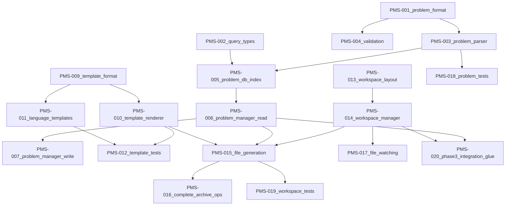

# Phase 2 — Problem Management System (PMS) — Task Plan

This document breaks Phase 2 (“Problem Management System”) into **small, parallelizable tasks** for multiple agents, with explicit dependencies and order of execution.

Source: `.specs/deno-rewrite/plan.md` (Phase 2: Week 3).

## Scope

- **In scope**: Problem data format + loading/indexing, `ProblemManager` APIs, template system, workspace/file generation utilities, and supporting tests.
- **Out of scope** (Phase 2): Full CLI command wiring (Phase 3), AI engine + test runner (Phase 4), backwards compatibility with legacy app (explicitly not supported).

## Conventions (from existing repo)

- **Tests**: `test/` directory, `*.test.ts` naming.
- **Imports**: `@std/*` for stdlib; include `.ts` for relative imports.
- **Errors**: Use `ProblemError`, `TemplateError`, `WorkspaceError` + `createErrorContext()` (`src/utils/errors.ts`).
- **12-factor output**: human-readable messages to stderr via `src/utils/output.ts`; stdout for machine output only.

## Phase 2 deliverables

- Problem database in new format: `src/data/problems/`
- Problem management core: `src/core/problem/`
- Template generation system: `src/data/templates/` + `src/core/problem/templates*`
- Workspace/file operation utilities: `src/core/workspace/`

## Target file/module layout

From `.specs/deno-rewrite/plan.md` (planned files to create):

- `src/core/problem/manager.ts`
- `src/core/problem/parser.ts`
- `src/core/problem/templates.ts`
- `src/core/problem/types.ts`
- `src/core/workspace/manager.ts`
- `src/core/workspace/files.ts`
- `src/core/workspace/types.ts`
- `src/data/problems/` (seed/converted data)
- `src/data/templates/` (language templates)

## Dependency graph (high level)

## Parallel execution lanes

- **Lane A (Problems core)**: PMS-001 → PMS-002 → (PMS-003 + PMS-004 in parallel) → PMS-005 → PMS-006 → PMS-007 → PMS-018
- **Lane B (Templates)**: PMS-009 → PMS-010 → PMS-011 (parallel per language) → PMS-012
- **Lane C (Workspace)**: PMS-013 → PMS-014 → PMS-015 → PMS-016 → PMS-017 → PMS-019
- **Lane D (Data seeding)**: PMS-008 can start after PMS-001 and proceed in parallel with Lanes B/C.

## Task summary

| ID      | Task                                         | Depends on                | Parallelizable?    |
| ------- | -------------------------------------------- | ------------------------- | ------------------ |
| PMS-001 | Problem on-disk format + layout              | -                         | Yes                |
| PMS-002 | Problem query/search API types               | PMS-001                   | Yes                |
| PMS-003 | Problem parser + normalization               | PMS-001                   | Yes                |
| PMS-004 | Strengthen `validateProblem()`               | PMS-001                   | Yes                |
| PMS-005 | Problem database builder + indexing          | PMS-002, PMS-003          | Limited            |
| PMS-006 | `ProblemManager` read API                    | PMS-005                   | Limited            |
| PMS-007 | `ProblemManager` write API (custom problems) | PMS-006                   | Limited            |
| PMS-008 | Seed `src/data/problems/`                    | PMS-001                   | Yes                |
| PMS-009 | Template format + placeholders               | -                         | Yes                |
| PMS-010 | Template renderer + resolution               | PMS-009                   | Limited            |
| PMS-011 | Language template packs                      | PMS-009                   | Yes (per language) |
| PMS-012 | Template tests                               | PMS-010, PMS-011          | Limited            |
| PMS-013 | Workspace layout + path rules                | -                         | Yes                |
| PMS-014 | WorkspaceManager init + structure            | PMS-013                   | Limited            |
| PMS-015 | Workspace file generation                    | PMS-006, PMS-010, PMS-014 | Limited            |
| PMS-016 | Complete/archive operations                  | PMS-015                   | Yes                |
| PMS-017 | File watching hooks                          | PMS-014                   | Yes                |
| PMS-018 | Problem parser/DB tests                      | PMS-003, PMS-005, PMS-006 | Yes                |
| PMS-019 | Workspace generation tests                   | PMS-015                   | Yes                |
| PMS-020 | Minimal Phase 3 integration glue             | PMS-006, PMS-014, PMS-015 | Yes                |

---

## PMS-001 — Define on-disk problem format + folder layout

- **Depends on**: none
- **Goal**: Standardize on-disk representation so parsing/indexing/templates can proceed in parallel.

### Subtasks

- **Choose file format**:
  - Default: JSON files (easy conversion + validation).
  - Decide whether to support additional formats in Phase 2 (recommend: no).
- **Required fields** (from `src/types/global.ts` `Problem`):
  - Required: `id`, `slug`, `title`, `difficulty`, `description`, `examples`
  - Optional: `constraints`, `hints`, `tags`, `companies`, `leetcodeUrl`, `metadata`
  - Defaults: missing arrays normalize to `[]`; missing optionals remain `undefined`.
- **Metadata encoding**:
  - Decide encoding for `ProblemMetadata.createdAt/updatedAt` (recommend: ISO-8601 string in JSON).
  - Document parsing expectations (string → `Date` in memory).
- **Naming and uniqueness rules**:
  - File path: `src/data/problems/<slug>.json`
  - `id` and `slug` must be unique across built-in + custom problems.
- **Provide an example**:
  - Include one complete example JSON problem (with at least 1 tag and 1 example).

### Definition of done

- The spec is written (including the example) and is unambiguous.

---

## PMS-002 — Define problem query/filter/search API (types)

- **Depends on**: PMS-001
- **Goal**: Define stable shapes Phase 3 can depend on and Phase 2 can implement.

### Subtasks

- Define `ProblemQuery` fields (suggested baseline):
  - `difficulty?: Difficulty | Difficulty[]`
  - `tags?: string[]` (decide: match-any vs match-all)
  - `companies?: string[]`
  - `text?: string`
  - `limit?: number`, `offset?: number`
- Define lookup APIs:
  - `getById(id)`
  - `getBySlug(slug)`
- Define ordering behavior:
  - Default stable sort (e.g., title asc) unless `sortBy` is added.

### Definition of done

- The query semantics are explicitly documented (match-any/all, case sensitivity, etc.).

---

## PMS-003 — Implement problem parsing + normalization

- **Depends on**: PMS-001
- **Goal**: Convert a single on-disk problem file into a validated in-memory `Problem`.

### Subtasks

- Read + parse JSON.
- Validate using `validateProblem()` (and updated rules from PMS-004).
- Normalize:
  - Ensure missing arrays become `[]`.
  - Convert metadata date strings to `Date` objects (if chosen in PMS-001).
- Error handling:
  - Throw `ProblemError` with `createErrorContext('parseProblem', { path, ... })`.

### Definition of done

- Parser behavior is implemented and unit-tested (PMS-018).

---

## PMS-004 — Extend `validateProblem()` to match Phase 2 needs

- **Depends on**: PMS-001
- **Goal**: Reject bad data early with actionable errors.

### Subtasks

- Validate `slug` is kebab-case and non-empty.
- Validate `tags` / `companies` are arrays of non-empty strings.
- Optionally validate `examples` more strictly (input object, output exists).
- Keep errors aggregated (report multiple issues at once).

### Definition of done

- `validateProblem()` rejects clearly invalid problems with helpful messages + tests.

---

## PMS-005 — Implement problem database builder + indexing

- **Depends on**: PMS-002, PMS-003
- **Goal**: Load all problems and build indices for fast lookups/filters.

### Subtasks

- Scan built-in directory `src/data/problems/`.
- (If supported) scan custom directory in XDG data home.
- Build indices:
  - `byId`, `bySlug`
  - `byDifficulty`, `byTag`, `byCompany`
- Enforce uniqueness:
  - Fail-fast on duplicate `id` or `slug` (at least for built-in problems).
- Decide invalid-entry behavior:
  - Recommended: fail-fast for built-ins, configurable warn+skip for custom.

### Definition of done

- Index construction is deterministic and duplication behavior is tested.

---

## PMS-006 — Implement `ProblemManager` read API (list/get/filter/search)

- **Depends on**: PMS-005
- **Goal**: Provide read-only operations for Phase 3 commands.

### Subtasks

- Implement:
  - `getById(id)` / `getBySlug(slug)` (decide return-null vs throw and document)
  - `list(query)` with semantics from PMS-002
  - `search(text)` (or `list({ text })`)
  - `getRandom(query)` for challenge selection
- Document performance assumptions (in-memory index is fine for Phase 2 scale).

### Definition of done

- Read API is fully specified, implemented, and covered by tests (PMS-018).

---

## PMS-007 — Implement `ProblemManager` write API (CRUD) for user/custom problems

- **Depends on**: PMS-006
- **Goal**: Allow user-defined problems without modifying built-in `src/data/problems`.

### Subtasks

- Decide storage root (recommend): `$XDG_DATA_HOME/algo-trainer/problems/`.
- Implement:
  - `add(problem)` (validate + write + index update)
  - `update(idOrSlug, patch)` (validate + write + index update)
  - `remove(idOrSlug)` (delete + index update)
- Ensure safe writes (temp file + rename if feasible).

### Definition of done

- CRUD works with temp-dir based tests (no real user filesystem dependencies).

---

## PMS-008 — Create initial problem set + conversion approach

- **Depends on**: PMS-001
- **Goal**: Seed a representative dataset for development and tests.

### Subtasks

- Create ~10–20 problems across difficulties with diverse tags.
- Choose conversion approach:
  - hand-curate, or
  - build a small conversion script from legacy (optional).
- Validate all seed problems pass parsing + indexing.

### Definition of done

- `src/data/problems/` contains a seed set used by tests/fixtures.

---

## PMS-009 — Define template format + placeholders

- **Depends on**: none
- **Goal**: Standardize templates in `src/data/templates/` and define placeholder vocabulary.

### Subtasks

- Define directory layout (recommended):
  - `src/data/templates/<language>/<style>/solution.tpl`
  - `src/data/templates/<language>/<style>/test.tpl`
  - `src/data/templates/<language>/<style>/README.tpl`
- Define placeholder contract (minimum recommended set):
  - `{{PROBLEM_TITLE}}`, `{{PROBLEM_SLUG}}`, `{{PROBLEM_DIFFICULTY}}`
  - `{{PROBLEM_DESCRIPTION}}`
  - `{{EXAMPLES}}`, `{{CONSTRAINTS}}`, `{{HINTS}}`, `{{TAGS}}`
  - `{{LANGUAGE}}`, `{{TEMPLATE_STYLE}}`
- Define mapping: `UserPreferences.templateStyle` → `<style>` directory.

### Definition of done

- Placeholder contract is documented and includes a worked template example.

---

## PMS-010 — Implement template renderer + config mapping

- **Depends on**: PMS-009
- **Goal**: Render template files into strings given `Problem` + `TemplateConfig`.

### Subtasks

- Resolve correct template path for a `(language, style, kind)` tuple.
- Implement renderer:
  - placeholder replacement
  - formatting helpers (bullet lists, examples formatting, etc.)
  - unknown placeholders error by default (document exceptions if any)
- Error handling:
  - `TemplateError` with `createErrorContext('renderTemplate', { ... })`.

### Definition of done

- Renderer behavior is deterministic and unit-tested (PMS-012).

---

## PMS-011 — Add language template packs (parallelizable)

- **Depends on**: PMS-009
- **Goal**: Provide templates for every `SupportedLanguage`.

### Subtasks (parallel per language)

- For each language (`typescript`, `javascript`, `python`, `java`, `cpp`, `rust`, `go`):
  - Provide `solution.tpl`, `test.tpl`, and `README.tpl` for each style:
    - `minimal`
    - `documented`
    - `comprehensive`

### Definition of done

- Every language has a complete template set and conforms to the shared placeholder contract.

---

## PMS-012 — Template tests (renderer + fixtures)

- **Depends on**: PMS-010, PMS-011
- **Goal**: Prevent regressions in template behavior/output.

### Subtasks

- Unit tests for:
  - placeholder substitution (happy path)
  - unknown placeholder errors
  - missing template file errors
- Fixture-based “golden output” tests for at least one language/style across:
  - solution
  - test scaffold
  - README

### Definition of done

- New tests pass reliably via `deno task test`.

---

## PMS-013 — Define workspace layout + path resolution rules

- **Depends on**: none
- **Goal**: Define the concrete workspace structure under `config.workspace`.

### Subtasks

- Map `WorkspaceStructure` fields to on-disk directories:
  - `root`, `problems`, `completed`, `templates`, `config`
- Define per-problem paths:
  - folder naming (recommend: `problems/<slug>/`)
  - file naming for solution/test/README
- Define overwrite/conflict rules (explicit and testable).

### Definition of done

- Workspace layout is fully specified and referenced by PMS-014/PMS-015.

---

## PMS-014 — Implement `WorkspaceManager` init + structure creation

- **Depends on**: PMS-013
- **Goal**: Create/validate directories and resolve `WorkspaceStructure`.

### Subtasks

- Implement:
  - `getWorkspaceStructure(root): WorkspaceStructure`
  - `initWorkspace(root): Promise<void>` creating required dirs
- Error handling:
  - `WorkspaceError` with `createErrorContext()`
- Testing:
  - Use temp directory; assert directories exist.

### Definition of done

- Workspace init works and is tested.

---

## PMS-015 — Implement workspace file generation (solution/test/README)

- **Depends on**: PMS-006, PMS-010, PMS-014
- **Goal**: Generate working files in the workspace for a selected problem.

### Subtasks

- Decide output paths based on PMS-013.
- Generate:
  - solution file (language-specific extension)
  - test scaffold (minimal Phase 2 version is acceptable)
  - README (rendered from templates + problem data)
- Ensure overwrite policy is explicit and enforced.

### Definition of done

- End-to-end generation works for at least one language and is tested (PMS-019).

---

## PMS-016 — Implement “complete/archive” file moves

- **Depends on**: PMS-015
- **Goal**: Move an active problem folder to `completed/` (Phase 3 will call it).

### Subtasks

- Define semantics:
  - move vs copy (recommend: move)
  - collision handling (timestamp suffix, error, or overwrite)
- Implement and test.

### Definition of done

- Complete/archive operations are deterministic and tested.

---

## PMS-017 — Implement file watching + auto-refresh hooks

- **Depends on**: PMS-014
- **Goal**: Provide optional watch utilities (later used by CLI/dev flows).

### Subtasks

- Implement watcher wrapper:
  - debounce
  - typed events (problem changed, template changed)
- Ensure cleanup:
  - watcher can be stopped/closed.

### Definition of done

- Watcher module exists and has a small sanity test or documented manual test.

---

## PMS-018 — Problem parser/database tests

- **Depends on**: PMS-003, PMS-005, PMS-006
- **Goal**: Ensure parsing/indexing/filtering behavior is correct.

### Subtasks

- Tests for:
  - parsing valid/invalid problem JSON
  - duplicate `id` / `slug` handling
  - basic filtering and search

### Definition of done

- Tests pass without network access.

---

## PMS-019 — Workspace generation tests

- **Depends on**: PMS-015
- **Goal**: Ensure file generation works without touching real user files.

### Subtasks

- Use temp workspace dir.
- Assert:
  - expected files exist
  - contents are non-empty and include key markers (e.g., title appears in README)
  - overwrite behavior matches spec

### Definition of done

- Tests are robust across OS path differences.

---

## PMS-020 — Integration glue (minimal) for Phase 3

- **Depends on**: PMS-006, PMS-014, PMS-015
- **Goal**: Ensure Phase 3 can consume PMS APIs with minimal wiring and without deep imports.

### Subtasks

- Ensure public APIs are clean (optionally add `mod.ts` re-exports under `src/core/problem/` and `src/core/workspace/`).
- Add short usage notes for Phase 3 implementers (doc comments or a short spec note).

### Definition of done

- Phase 3 implementers can call `ProblemManager` + workspace file generation without internal-module spelunking.
